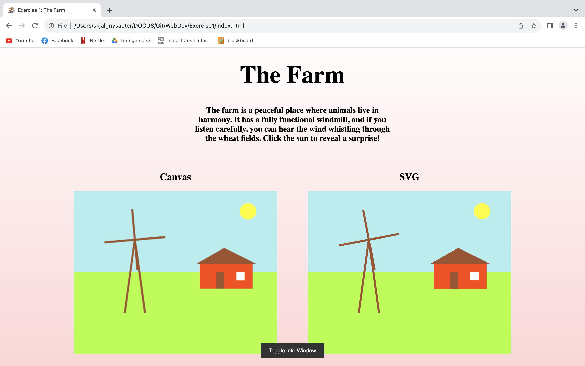

<!-- PROJECT LOGO -->
 

  

  <h3 align="center"> Web Development Excercises</h3>

  

    Thought about taking this course remote in Australia, but found **cloud computing** which was basically the same but with cloud components.
  

<!-- ABOUT THE PROJECT -->
## About The Project

Only did the first Assignment. This was purely html, js, and css.

  

<!-- GETTING STARTED -->
## Getting Started

Running the program is very easy and requires no special imports or API keys so far. Just clone the project, copy the path to the frontpage and paste it into a chrome browser.

### Built With

* JavaScript
* html
* css

<!-- CONTACT -->
## Contact

Skjalg Nysaeter - skjalgn@gmail.com

Project Link: [https://github.com/skjalgn/ProjectSpotify](https://github.com/skjalgn/ProjectSpotify)

(<a href="#readme-top">back to top</a>)

